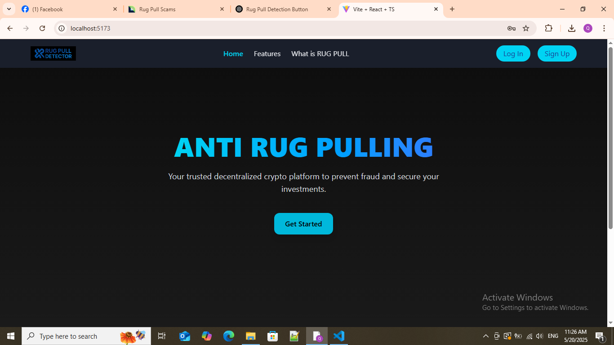
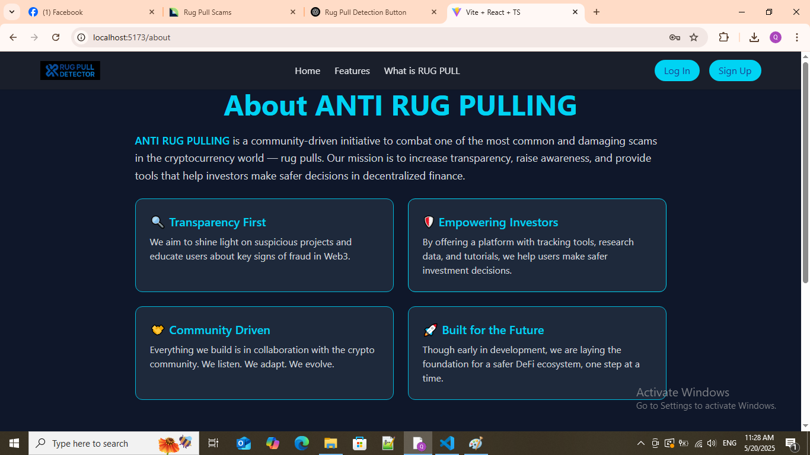
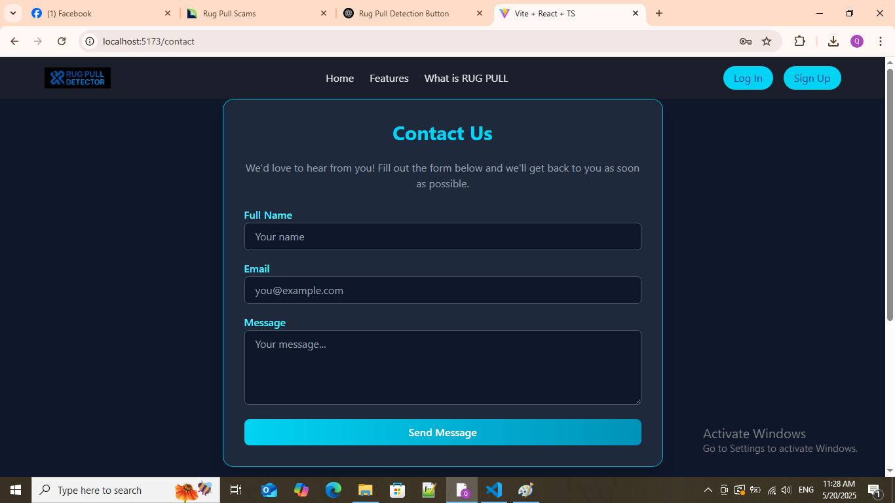
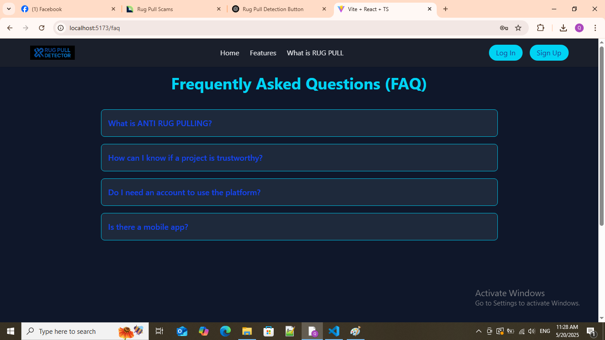
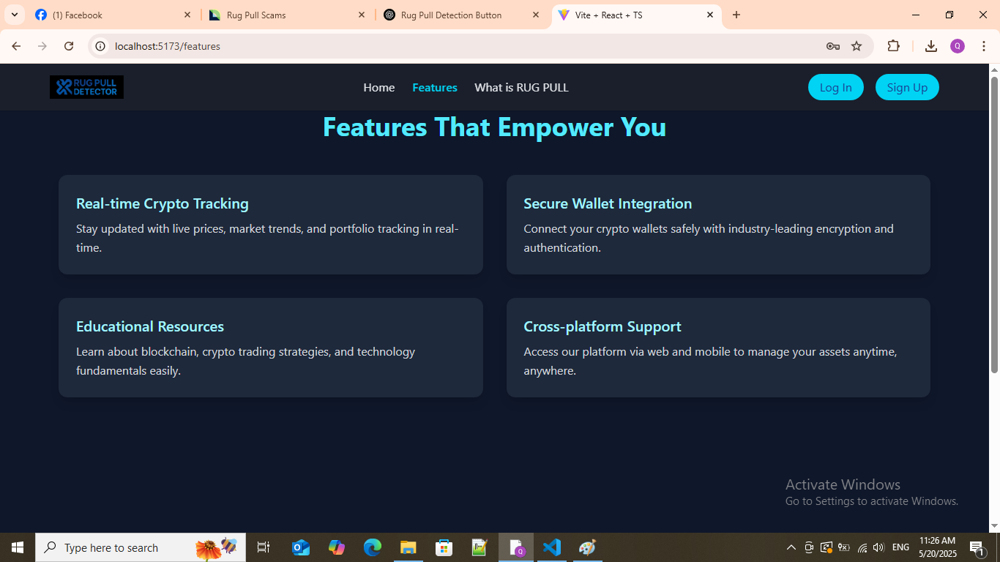
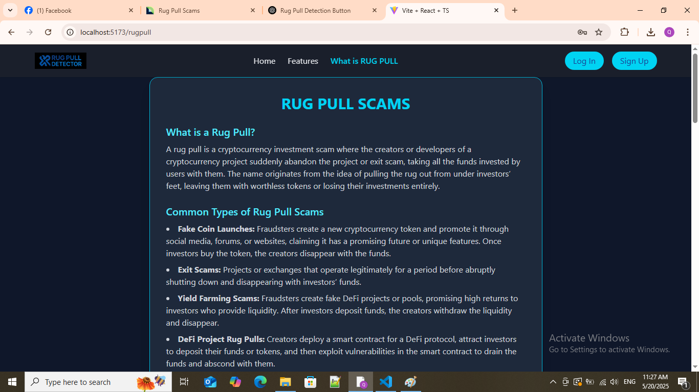
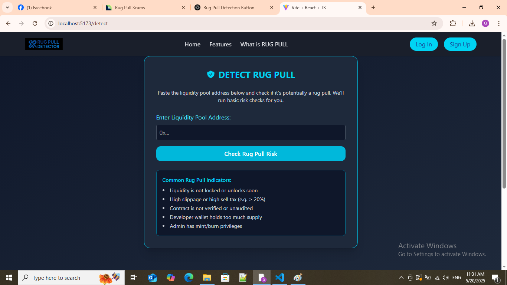
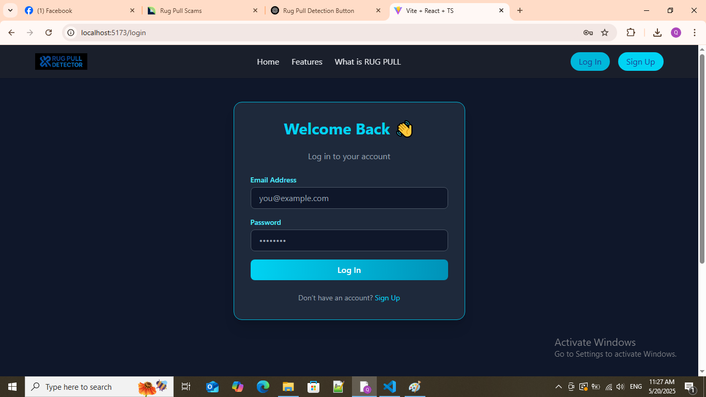
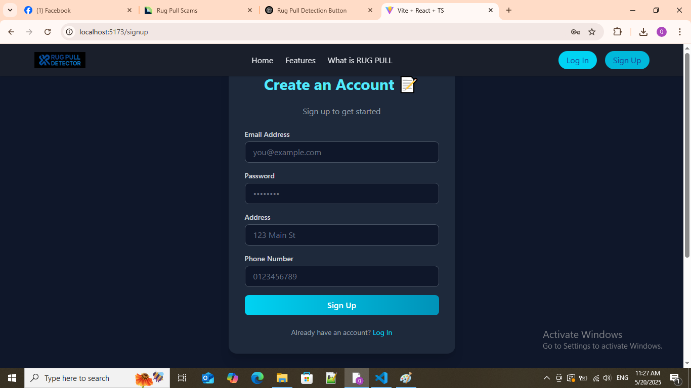

# 🛡️ ANTI RUG PULLING

A sleek, responsive crypto-inspired UI built with React + Vite + Tailwind CSS.  
Designed to simulate a landing page for a crypto protection platform.

> **Note:** This is a frontend-only project (no backend/API yet).  
> Suitable for practice, demo, and future expansion.

---

## 🚀 Features

- 🔐 Login & Signup Pages (with form validation)
- 📄 About, Contact, FAQ, and Features informational pages
- 🌙 Dark mode UI with modern colors
- 📱 Responsive design with mobile menu
- 🔧 Built with React, Tailwind, React Router, Lucide Icons

---

## 📸 Screenshots

### 🏠 Home Page


### 🏠 About Page


### 🏠 Contact Page

### 🏠 FAQ Page

### 🏠 Feature Page

### 🏠 RugPull Page

### 🏠 Detect Page

### 🏠 Login Page

### 🏠 SignUp Page


## 🧰 Tech Stack

- **React + Vite**
- **TypeScript**
- **Tailwind CSS**
- **React Router**
- **Lucide Icons**

---

## 📁 Project Structure


---

## ⚙️ Getting Started

```bash
# Clone the repo
git clone https://github.com/Vanquoc0201/FE_RugPull.git

# Navigate into project
cd FE_RugPull

# Install dependencies
npm install

# Start development server
npm run dev
