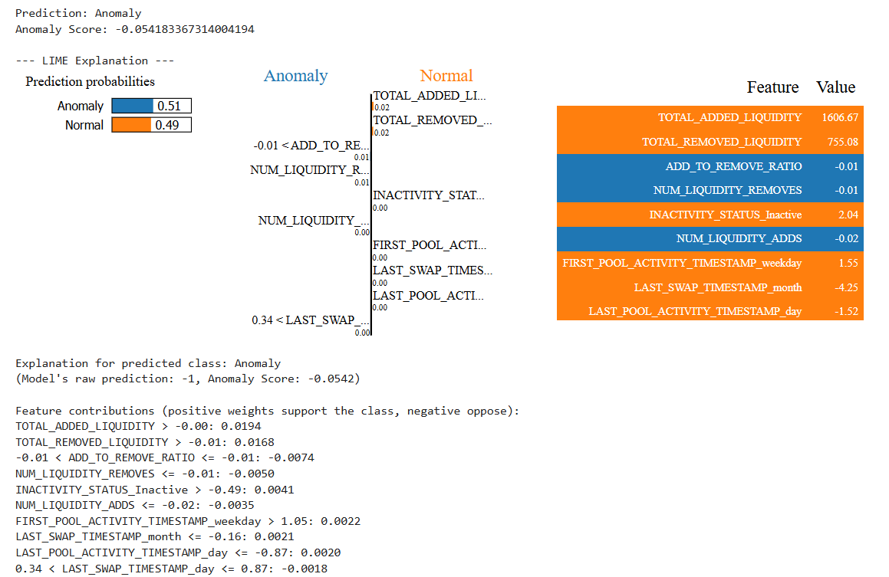

# 🧠 Rug Pull Detection on Solana DeFi
## 📌 Overview
This project develops a machine learning model to detect rug pull scams within the Solana decentralized finance (DeFi) ecosystem. Rug pulls are a form of fraud where malicious developers abandon projects after withdrawing investor funds, causing financial loss.

The methodology is inspired by:
**[SolRPDS: A Dataset for Analyzing Rug Pulls in Solana Decentralized Finance](https://arxiv.org/abs/2504.07132)** - Abdulrahman Alhaidari et al., CODASPY 2025

We utilize the SolRPDS dataset, which was curated from 3.69 billion Solana transactions, offering a robust foundation for identifying rug pull patterns.

## 🧪 Methodology
Our approach leverages the Isolation Forest algorithm, a popular anomaly detection technique that excels in high-dimensional, unlabeled datasets like blockchain records.

**Why Isolation Forest?**

It isolates anomalies instead of profiling normal data points, making it ideal for detecting rare and subtle fraud behaviors.

**Optimization Metric:**

We tune the threshold to maximize the F2-score, giving higher weight to recall — crucial in fraud detection, where catching more scams is prioritized over minimizing false positives.

## 📊 Evaluation Results
Optimized Threshold: 0.2059

F2-Score: 0.8954

Precision: 0.9328

Recall: 0.8865

## 📈 Classification Report
Class	Precision	Recall	F1-Score	Support
-1 (Anomaly)	0.93	0.89	0.91	141
1 (Normal)	1.00	1.00	1.00	4781

Accuracy: 0.99 (4922 samples)

Macro Avg: Precision: 0.96, Recall: 0.94, F1-score: 0.95

Weighted Avg: Precision: 0.99, Recall: 0.99, F1-score: 0.99

## 🧠 Explainable AI (LIME)
We used LIME (Local Interpretable Model-Agnostic Explanations) for explainability, helping users understand the decision-making process of the model.

## 📂 Dataset: SolRPDS
The SolRPDS dataset is a publicly available, large-scale dataset designed for analyzing rug pulls in the Solana DeFi ecosystem.

🔹 Source: Extracted from 3.69 billion Solana blockchain transactions

🔹 License: Creative Commons Attribution 4.0 International (CC BY 4.0)

🔹 Purpose: Enables robust research on fraudulent behavior in decentralized finance systems

## 📖 Citation
If you use the dataset in your work, please cite the original authors:

>Abdulrahman Alhaidari, Bhavani Kalal, Balaji Palanisamy, and Shamik Sural. 2025. SolRPDS: A Dataset for Analyzing Rug Pulls in Solana Decentralized Finance. In Proceedings of the 15th ACM Conference on Data and Application Security and Privacy (CODASPY '25). ACM, New York, NY, USA. (To appear)

## 👥 Team Members

| Name              | Role                                      |
|-------------------|-------------------------------------------|
| Phan Duc Anh      | Team Leader, Machine Learning, Management |
| Nguyen Tran Lam   | Idea Contributor, Documentation           |
| Nguyen Minh Dai   | Backend Developer                         |
| Vo Van Quoc       | Frontend Developer                        |
| Vo Tuan Hung      | Frontend Developer                        |

## 📜 License & Usage
This project is licensed under the Creative Commons Attribution 4.0 International License (CC BY 4.0).
You are free to use, modify, and distribute the project, provided you credit the original dataset source appropriately.

## ❓ Need Help or Want to Extend?
We’re happy to add extra sections such as:

- 🔧 Installation & Setup Guide

- 🧠 Model Training Pipeline

- 📈 Evaluation & Visualization Tools

Just let us know what you need!

